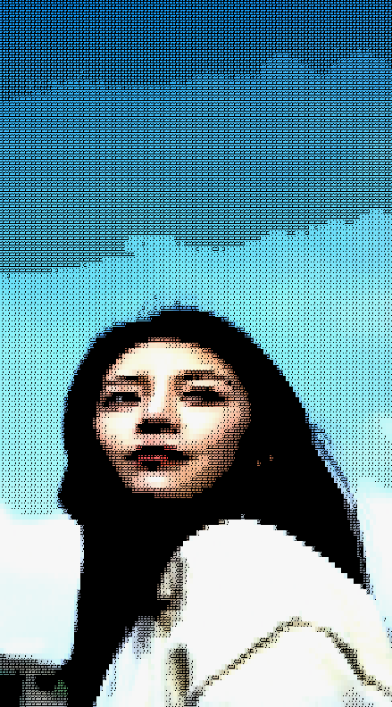

# ASCII Art Converter

## 🎨 Overview
Aplikasi web profesional untuk mengkonversi gambar, video, dan webcam menjadi ASCII art dengan kualitas super tinggi dan akurat. Menggunakan algoritma advanced image processing untuk hasil terbaik.

## ✨ Fitur Utama

### 🖼️ Mode Konversi
- **Image Mode**: Upload dan konversi gambar (JPG, PNG, GIF, WEBP, BMP)
- **Video Mode**: Konversi video frame-by-frame dengan real-time preview (MP4, WebM, OGG, MOV)
- **Webcam Mode**: Live ASCII art dari webcam dengan 30 FPS

### 🎯 Teknologi Advanced
- **Character Density Mapping**: Pre-calculated density untuk setiap karakter untuk akurasi maksimal
- **Floyd-Steinberg Error Diffusion**: Gradient halus dan transisi natural
- **Sobel Edge Detection**: Preservasi detail dan kontur objek
- **Unsharp Masking**: Sharpening yang presisi
- **Adaptive Gamma Correction**: Koreksi brightness yang dinamis berdasarkan edge strength
- **sRGB Color Space**: Luminance calculation yang akurat (0.2126*R + 0.7152*G + 0.0722*B)

### 🎨 Kontrol Kreatif
- **Width**: 50-300 karakter
- **Quality**: Low, Medium, Good, High, Ultra (5 preset)
- **Font Size**: 6-20px untuk output yang fleksibel
- **Contrast**: 1.0-2.5x untuk penyesuaian tone
- **Brightness**: 0.5-2.0x untuk exposure control
- **Sharpness**: 0.5-2.0x untuk detail enhancement

### 🌈 Color Modes
- **Full Color**: Warna asli dengan enhanced saturation
- **Green**: Matrix-style monochrome hijau
- **B&W**: Black and white classic
- **Retro**: Amber terminal aesthetic

### 📝 Character Sets
- **Standard**: Basic ASCII karakter
- **Detailed**: 70+ karakter untuk detail maksimal
- **Simple**: Minimalist 5 karakter
- **Blocks**: Unicode block elements
- **Numbers**: 0-9 numeric style
- **Enhanced**: Optimized 70+ karakter (default, paling akurat)

### 🚀 Fitur Tambahan
- **Fullscreen Mode**: View dengan zoom dan pan support
- **Zoom**: 25%-500% dengan mouse wheel
- **Pan**: Drag untuk navigate saat zoom
- **Copy ASCII**: Copy text-based ASCII ke clipboard
- **Download**: Save hasil sebagai PNG image
- **Capture Frame**: Snapshot dari webcam atau video
- **Responsive**: Perfect di desktop, tablet, dan mobile

## 🏗️ Struktur Project
```
.
├── index.html          # Main HTML structure
├── style.css           # Professional styling
├── script.js           # Advanced ASCII conversion algorithms
├── sample-image/       # Sample ASCII art results
└── README.MD          # Documentation
```

## 🚀 Cara Menggunakan
Buka file `index.html` langsung di browser. Semua berjalan di client-side, tidak perlu server.

## 🔧 Teknologi
- **Frontend**: Pure HTML5, CSS3, JavaScript (ES6+)
- **Canvas API**: Real-time image processing
- **MediaDevices API**: Webcam access
- **Static**: Tidak ada server/backend, murni client-side

## 📱 Responsive Design
- Desktop: Full sidebar + canvas layout
- Tablet: Stacked layout dengan scroll
- Mobile: Optimized touch controls dan compact UI

## 🎯 Algoritma Konversi
1. **Pre-processing**: Resize gambar sesuai width yang dipilih
2. **Enhancement**: Apply brightness, contrast, dan sharpness
3. **Edge Detection**: Sobel operator untuk detect kontur
4. **Luminance Calculation**: sRGB weights untuk accuracy
5. **Character Mapping**: Density-based matching untuk setiap pixel
6. **Error Diffusion**: Floyd-Steinberg untuk smooth gradients
7. **Color Rendering**: Enhanced saturation dan gamma correction

## 🚀 Performance
- Real-time video: 30 FPS target
- Webcam live: Smooth 30 FPS rendering
- Optimized canvas operations dengan `willReadFrequently` flag
- Efficient memory management dengan typed arrays

## 📝 Recent Changes
- 2025-11-02: Initial import dan setup
- Advanced ASCII conversion dengan density mapping
- Edge detection dan error diffusion
- Professional UI redesign
- Full responsive support

## 🎨 Design Philosophy
- Clean dan professional, tidak lebai
- Minimalist controls dengan maximum functionality
- Intuitive user experience
- Performance-first approach

## 🖼️ ASCII Art

### Blok



---

### Number


## 👤 Author
Davanico Ady Nugroho © 2025
